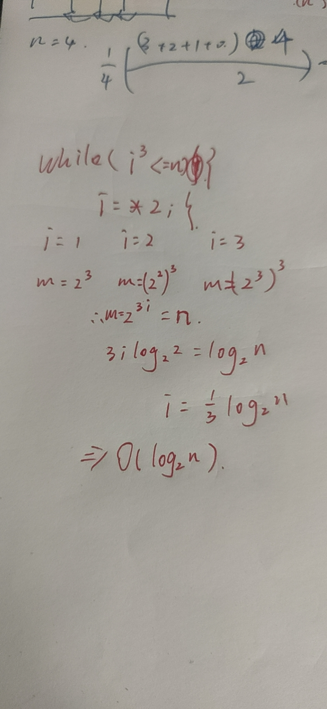

# 数据结构

## 第一章：绪论

### 1.1基本概念

1. 数据：数据是信息的载体，可以被计算机程序识别和处理的符号集合
2. 数据元素：数据元素的数据的基本单位，一个数据元素可以由若干个数据组成
2.2 数据项：是数据元素不可分割的最小单位
3. 数据对象：具有相同特征的数据元素的集合
4. 数据类型：一个值定义的集合和定义在此集合上的一组操作总称
5. 数据结构：相互存在一种或多种特定关系的数据元素集合

#### 1.1.2数据结构三要素

1. 数据的逻辑结构

2. 数据的存储结构（物理结构）：
        2.1：顺序存储
        2.2：链式存储
        2.3：索引存储
        2.4：散列存储（哈希存储）
3. 数据的运算

#### extra1

1. 完整的数据结构可以由 ： 抽象数据类型 定义     不可以由 单一的数据元素，数据对象或数据关系定义
2. 有序表仅仅描述元素之间的逻辑关系，既可以是链式存储，也可以是顺序存储
3. 栈是一种抽象的数据类型，可以是顺序或链式，只表示逻辑结构，而循环队列是顺序表表示的队列属于存储结构
4. 数据的逻辑结构独立于其存储结构
5. 链式存储设计时，结点内的存储单元地址是连续的，结点与结点之间的存储地址可以是不连续的。

## 1.2 算法和算法评价

### 1.2.1算法的基本概念

 1. 算法是对特定问题求解步骤的一种描述，它是指令的有限序列，每条指令表示一条或多条操作。

 2. 算法的五个重要特征：1）有穷性 ， 2）确定性 ， 3）可行性 ， 4）输入 ， 5）输出
 3. 好的算法应该达到的目标：1） 正确性 ， 2）可读性 ， 3）健壮性 ， 4）效率与低存储量需求

### 1.2.2 算法效率的度量

1. 时间复杂度:
    设运行m次：正常情况i*=2为O（logn）

    正常情况i+=2为O（n）

    for循环下，把每一次循环的时间复杂度算出，相乘为总时间复杂度（相关的用共同变量n代替，不相关的直接相乘）

##### 特殊情况：循环内增加的变量与自己无关时

    如s=0； i=0；++i；s=s+i； 时间复杂度为O（n^1/2)


2011:正常情况1直接选
2012：一个数的阶乘如5x4x3x2x1 为O(5)及O(n)


2014:for循环独立，不存在链式相关，直接乘
2017：特殊情况，直接选
2019：自己与自己相乘，开根

内层变式嵌套推到

2. 空间复杂度

## 第二章：线性表

### 2.1线性表的定义和操作

#### 2.1.1 线性表定义

线性表是具有相同数据类型的n个数据元素的有限序列

#### 2.2.1顺序表定义

线性表的顺序存储又称顺序表。使用一组地址连续的存储单元依次存储线性表的数据元素，从而使得逻辑上相邻的两个元素在物理位置上也相邻。但是线性表是逻辑结构。
顺序存储的线性表才是物理结构（存储结构）

顺序存取是链式的一种特征，随机存取是顺序存储的一种特征

##### 顺序表的初始化

```c
#include<stdio.h>
#define MaxSize 10   //定义表的最大长度 
typedef struct{
 int data[MaxSize];//用静态的"数组"存放数据元素
 int length; //顺序表的当前长度  
}SqList;        //顺序表的类型定义（静态分配方式） 
void InitList(SqList &L){
  for(int i=0;i<MaxSize;i++){
   L.data[i]=0;  //将所有数据元素设置为默认初始值
    
  }
  L.length=0;
}
int main(){
 SqList L;//声明一个顺序表
 InitList(L);//初始化一个顺序表
 for(int i=0;i<MaxSize;i++){
  printf("data[%d]=%d\n",i,L.data[i]);
 }
 return 0; 
}
```

```c++
#include<iostream>
using namespace std;

const int MaxSize = 100;
template <class DataType>
class SeqList
{
public:
    SeqList(){length=0;};            
    SeqList(DataType a[],int n);    
    ~SeqList(){};                    
    int Length(){return length;}; 
    DataType Get(int i);            
    int Locate(DataType x);         
    void Insert(int i,DataType x);  
    DataType Delete(int i);         
    void PrintList();               
private:
    DataType data[MaxSize];         
    int length;                     
};

template <class DataType>
SeqList<DataType>::SeqList(DataType a[],int n)
{
    if(n>MaxSize) throw "wrong parameter";
    for(int i=0;i<n;i++)
        data[i]=a[i];
    length=n;
}

template <class DataType>
DataType SeqList<DataType>::Get(int i)
{
    if(i<1 && i>length) throw "wrong Location";
    else return data[i-1];
}

template <class DataType>
int SeqList<DataType>::Locate(DataType x)
{
    for(int i=0;i<length;i++)
        if(data[i]==x) return i+1;
    return 0;
}

template <class DataType>
void SeqList<DataType>::Insert(int i,DataType x)
{
    if(length>=MaxSize) throw "Overflow";
    if(i<1 || i>length+1) throw "Location";
    for(int j=length;j>=i;j--)
        data[j]=data[j-1];
    data[i-1]=x;
    length++;
}

template <class DataType>
DataType SeqList<DataType>::Delete(int i)
{
    int x;
    if(length==0) throw "Underflow";
    if(i<1 || i>length) throw "Location";
    x = data[i-1];
    for(int j=i;j<length;j++)
        data[j-1] = data[j];
    length--;
    return x;
}

template <class DataType>
void SeqList<DataType>::PrintList()
{
    for(int i=0;i<length;i++)
        cout<<data[i]<<endl;
}

int main()
{
    SeqList<int> p;
    p.Insert(1,5);
    p.Insert(2,9);
    p.PrintList();
    p.Insert(2,3);
    cout<<p.Length()<<endl;
    p.PrintList();
    cout<<p.Get(3)<<endl;
    p.Delete(2);
    p.PrintList();
    return 0;
}

```

### 动态顺序表基本操作（C语言）

```c
#include <iostream>
using namespace std;
#include<stdlib.h>//malloc、free函数的头文件 
#define InitSize 10 //默认的最大长度
typedef struct{
 int  *data;//指示动态分配数组的指针
 int MaxSize; //顺序表的最大容量
 int length;  //顺序表的当前长度 
}SeqList; 
//初始化
void InitList(SeqList &L){
 //用malloc 函数申请一片连续的存储空间
 L.data =(int*)malloc(InitSize*sizeof(int)) ;
 L.length=0;
 L.MaxSize=InitSize;
} 
//增加动态数组的长度
void IncreaseSize(SeqList &L,int len){
 int *p=L.data;
 L.data=(int*)malloc((L.MaxSize+len)*sizeof(int));
 for(int i=0;i<L.length;i++){
  L.data[i]=p[i];   //将数据复制到新区域 
 }
 L.MaxSize=L.MaxSize+len; //顺序表最大长度增加len
 free(p);  //释放原来的内存空间 
 
} 
bool ListInsert(SeqList &L, int i, int e){ 
    //判断i的范围是否有效
    if(i<1||i>L.length+1) 
        return false;
    if(L.length>L.MaxSize) //当前存储空间已满，不能插入  
        return false;

    for(int j=L.length; j>i; j--){    //将第i个元素及其之后的元素后移
        L.data[j]=L.data[j-1];
    }
    L.data[i-1]=e;  //在位置i处放入e
    L.length++;      //长度加1
    return true;
}

bool LisDelete(SeqList &L, int i, int &e){ // e用引用型参数 
    //判断i的范围是否有效
    if(i<1||i>L.length) 
        return false;

    e = L.data[i-1];    //将被删除的元素赋值给e

    for(int j=L.length; j>i; j--){    //将第i个后的元素前移
        L.data[j-1]=L.data[j];
    }
    L.length--;      //长度减1
    return true;
}
double GetElem(SeqList L, int i){//ElemType GetElem(SqList L, int i)注意原本的数组数据类型
    // ...判断i的值是否合法
    //查找第i个值
    return L.data[i-1];      //注意是i-1
}
//寻找数组内的元素
int LocateElem(SeqList L, int e){
    for(int i=0; i<L.length; i++)
        if(L.data[i] == e)  
            return i+1;     //数组下标为i的元素值等于e，返回其位序i+1
    return 0;               //推出循环，说明查找失败
}
int main(void){
 SeqList L; //声明一个顺序表
 InitList(L);//初始化顺序表
 IncreaseSize(L,5);
 return 0; 
}
```

#### 顺序存储的优缺点

##### 优点

随机访问特性，查找O(1)时间，存储密度高；
逻辑上相邻的元素，物理上也相邻；
无须为表中元素之间的逻辑关系而增加额外的存储空间；

##### 缺点

插入和删除需移动大量元素；
当线性表长度变化较大时，难以确定存储空间的容量；
造成存储空间的“碎片”

### 2.3线性表的链式表示

#### 2.3.1 单链表的定义

定义： 线性表的链式存储又称单链表，它是指通过一组任意的存储单元来存储线性表中的数据元素。

```c
typedef struct LNode{//定义单链表结点类型
    ElemType data; //数据域
    struct LNode *next;//指针域
}LNode, *LinkList;
//相当于typedef struct LNode LNode;结点
//      typedef struct LNode *Linklist;链表
```

#### 不带头结点单链表初始化

```c
typedef struct LNode{
    ElemType data;
    struct LNode *next;
}LNode, *LinkList;

//初始化一个空的单链表
bool InitList(LinkList &L){  //注意用引用 &
    L = NULL; //空表，暂时还没有任何结点；
    return true;
}

void test(){
    LinkList L;  //声明一个指向单链表的指针: 头指针
    //初始化一个空表
    InitList(L);
    //...
}

//判断单链表是否为空
bool Empty(LinkList L){
    if (L == NULL)
        return true;
    else
        return false;
}

```

#### 头结点：代表链表上头指针指向的第一个结点，不带有任何数据

```c
typedef struct LNode{
    ElemType data;
    struct LNode *next;
}LNode, *LinkList;

//初始化一个单链表（带头结点）
LinkList List_HeadInsert(LinkList &L){       //逆向建立单链表
    LNode *s;
    int x;
    L = (LinkList)malloc(sizeof(LNode));     //建立头结点
    L->next = NULL;                          //初始为空链表,这步不能少！

    scanf("%d", &x);                         //输入要插入的结点的值
    while(x!=9999){                          //输入9999表结束
        s = (LNode *)malloc(sizeof(LNode));  //创建新结点
        s->data = x;
        r->next = L->next;
        L->next = s;                         //将新结点插入表中，L为头指针
        scanf("%d", &x);   
    }
    return L;
   
}

void test(){
    LinkList L;  //声明一个指向单链表的指针: 头指针
    //初始化一个空表
    List_HeadInsert(L);
    //...
}

//判断单链表是否为空（带头结点）
bool Empty(LinkList L){
    if (L->next == NULL)
        return true;
    else
        return false;
}
```

##### 带头结点和不带头结点的比较

不带头结点：写代码麻烦！对第一个数据节点和后续数据节点的处理需要用不同的代码逻辑，对空表和非空表的处理也需要用不同的代码逻辑; 头指针指向的结点用于存放实际数据;
带头结点：头指针指向的头结点不存放实际数据,头结点指向的下一个结点才存放实际数据;

#### 2.3.2单链表上基本操作的实现

##### 1.按位序插入（带头结点）平均时间复杂度：O(n)

ListInsert(&L, i, e)在表L中的第i个位置上插入指定元素e = 找到第i-1个结点(前驱结点)，将新结点插入其后；其中头结点可以看作第0个结点，故i=1时也适用

```c
typedef struct LNode{
    ElemType data;
    struct LNode *next;
}LNode, *LinkList;

//在第i个位置插入元素e（带头结点）
bool ListInsert(LinkList &L, int i, ElemType e){  
    //判断i的合法性, i是位序号(从1开始)
    if(i<1)
        return False;
    
    LNode *p;       //指针p指向当前扫描到的结点 
    int j=0;        //当前p指向的是第几个结点
    p = L;          //L指向头结点，头结点是第0个结点（不存数据）

    //循环找到第i-1个结点
    while(p!=NULL && j<i-1){     //如果i>lengh, p最后会等于NULL
        p = p->next;             //p指向下一个结点
        j++;
    }

    if (p==NULL)                 //i值不合法
        return false;
    
    //在第i-1个结点后插入新结点
    LNode *s = (LNode *)malloc(sizeof(LNode)); //申请一个结点
    s->data = e;
    s->next = p->next;
    p->next = s;                 //将结点s连到p后,后两步千万不能颠倒qwq

    return true;
}
```

##### 2.头插法

思想：设待插入结点是s，将s插入到p的前面。我们仍然可以将s插入到*p的后面。然后将p->data与s->data交换，这样既能满足了逻辑关系，又能是的时间复杂度为O(1).

```c
bool InsertPriorNode(LNode *p, ElenType e){
    if(p==NULL)
        return false;
    
    LNode *s = (LNode *)malloc(sizeof(LNode));
    if(s==NULL) //内存分配失败
        return false;
    s->next = p->next;
    p->next = s;       //新结点s连到p之后
    s->data = p->data; //将p中元素复制到s
    p->data = e;       //p中元素覆盖为e

    return true；
} 
```

##### 3.尾插法

InsertNextNode(LNode *p, ElemType e): 给定一个结点p，在其之后插入元素e; 根据单链表的链接指针只能往后查找，故给定一个结点p，那么p之后的结点我们都可知，但是p结点之前的结点无法得知;

```c
typedef struct LNode{
    ElemType data;
    struct LNode *next;
}LNode, *LinkList;

bool InsertNextNode(LNode *p, ElemType e){
    if(p==NULL){
        return false;
    }

    LNode *s = (LNode *)malloc(sizeof(LNode));
    //某些情况下分配失败，比如内存不足
    if(s==NULL)
        return false;
    s->data = e;          //用结点s保存数据元素e 
    s->next = p->next;
    p->next = s;          //将结点s连到p之后

    return true;
}                         //平均时间复杂度 = O(1)


//有了后插操作，那么在第i个位置上插入指定元素e的代码可以改成：
bool ListInsert(LinkList &L, int i, ElemType e){  
    if(i<1)
        return False;
    
    LNode *p;       //指针p指向当前扫描到的结点 
    int j=0;        //当前p指向的是第几个结点
    p = L;          //L指向头结点，头结点是第0个结点（不存数据）

    //循环找到第i-1个结点
    while(p!=NULL && j<i-1){     //如果i>lengh, p最后4鸟会等于NULL
        p = p->next;             //p指向下一个结点
        j++;
    }

    return InsertNextNode(p, e)
}
```

##### 4.按位序删除节点（带头结点）平均时间复杂度：O(n)

ListDelete(&L, i, &e): 删除操作，删除表L中第i个位置的元素，并用e返回删除元素的值;头结点视为“第0个”结点；
思路：找到第i-1个结点，将其指针指向第i+1个结点，并释放第i个结点；

```c
typedef struct LNode{
    ElemType data;
    struct LNode *next;
}LNode, *LinkList;

bool ListDelete(LinkList &L, int i, ElenType &e){
    if(i<1) return false;

    LNode *p;       //指针p指向当前扫描到的结点 
    int j=0;        //当前p指向的是第几个结点
    p = L;          //L指向头结点，头结点是第0个结点（不存数据）

    //循环找到第i-1个结点
    while(p!=NULL && j<i-1){     //如果i>lengh, p最后会等于NULL
        p = p->next;             //p指向下一个结点
        j++;
    }

    if(p==NULL) 
        return false;
    if(p->next == NULL) //第i-1个结点之后已无其他结点
        return false;

    LNode *q = p->next;         //令q指向被删除的结点
    e = q->data;                //用e返回被删除元素的值
    p->next = q->next;          //将*q结点从链中“断开”
    free(q)                     //释放结点的存储空间

    return true;
}

```

##### 5.指定结点的删除

```c
bool DeleteNode(LNode *p){
    if(p==NULL)
        return false;
    
    LNode *q = p->next;      //令q指向*p的后继结点
    p->data = p->next->data; //让p和后继结点交换数据域
    p->next = q->next;       //将*q结点从链中“断开”
    free(q);
    return true;
} //时间复杂度 = O(1)
```

#### 2.3.3单链表的查找

按位查找GetElem(L, i) 平均时间复杂度O（n）

```c
LNode * GetElem(LinkList L, int i){
    if(i<0) return NULL;
    
    LNode *p;               //指针p指向当前扫描到的结点
    int j=0;                //当前p指向的是第几个结点
    p = L;                  //L指向头结点,头结点是第0个结点(不存数据)
    while(p!=NULL && j<i){  //循环找到第i个结点
        p = p->next;
        j++;
    }

    return p;               //返回p指针指向的值
}
```

按位查找操作，获取表L中第i个位置的元素的值;
LocateElem(L, e):按值查找操作，在表L中查找具有给定关键字值的元素;

```c
LNode * LocateElem(LinkList L, ElemType e){
    LNode *P = L->next;    //p指向第一个结点
    //从第一个结点开始查找数据域为e的结点
    while(p!=NULL && p->data != e){
        p = p->next;
    }
    return p;           //找到后返回该结点指针，否则返回NULL
}
```

##### 链表的逆置

算法思想：逆置链表初始为空，原表中结点从原链表中依次“删除”，再逐个插入逆置链表的表头（即“头插”到逆置链表中），使它成为逆置链表的“新”的第一个结点，如此循环，直至原链表为空；

```c
LNode *Inverse(LNode *L)
{
 LNode *p, *q;
 p = L->next;     //p指针指向第一个结点
 L->next = NULL;  //头结点指向NULL

 while (p != NULL){
  q = p;
  p = p->next;
  q->next = L->next;  
  L->next = q;
 }
 return L;
}
```

#### 2.3.6双链表

双链表中节点类型的描述：

```c
typedef struct DNode{            //定义双链表结点类型
    ElemType data;               //数据域
    struct DNode *prior, *next;  //前驱和后继指针
}DNode, *DLinklist;
```

双链表的初始化（带头结点）

```c
typedef struct DNode{            //定义双链表结点类型
    ElemType data;               //数据域
    struct DNode *prior,*next;  //前驱和后继指针
}DNode, *DLinklist;

//初始化双链表
bool InitDLinkList(Dlinklist &L){
    L = (DNode *)malloc(sizeof(DNode));      //分配一个头结点
    if(L==NULL)                              //内存不足，分配失败
        return false;

    L->prior = NULL;   //头结点的prior指针永远指向NULL
    L->next = NULL;    //头结点之后暂时还没有结点
    return true;
}

void testDLinkList(){
    //初始化双链表
    DLinklist L;         // 定义指向头结点的指针L
    InitDLinkList(L);    //申请一片空间用于存放头结点，指针L指向这个头结点
    //...
}

//判断双链表是否为空
bool Empty(DLinklist L){
    if(L->next == NULL)    //判断头结点的next指针是否为空
        return true;
    else
        return false;
}

```

##### 双链表的插入操作

 后插操作
InsertNextDNode(p, s): 在p结点后插入s结点

```c
bool InsertNextDNode(DNode *p, DNode*s){ //将结点 *s 插入到结点*p之后
    if(p==NULL || s==NULL) //非法参数
        return false;

    s->next = p->next;
    if (p->next != NULL)   //p不是最后一个结点=p有后继结点  
        p->next->prior = s;
    s->prior = p;
    p->next = s;
    
    return true;
}

```

##### 按位序插入操作

思路：从头结点开始，找到某个位序的前驱结点，对该前驱结点执行后插操作；
前插操作：
思路：找到给定结点的前驱结点，再对该前驱结点执行后插操作；
双链表的删除操作
删除p节点的后继节点

```c
//删除p结点的后继结点
bool DeletNextDNode(DNode *p){
    if(p==NULL) return false;
DNode*q =p->next;            //找到p的后继结点q
    if(q==NULL) return false;     //p没有后继结点;
    p->next = q->next;
    if(q->next != NULL)           //q结点不是最后一个结点
        q->next->prior=p;
    free(q);

    return true;
}

//销毁一个双链表
bool DestoryList(DLinklist &L){
    //循环释放各个数据结点
    while(L->next != NULL){
        DeletNextDNode(L);  //删除头结点的后继结点
    free(L); //释放头结点
    L=NULL;  //头指针指向NULL

    }
}
```

##### 双链表的遍历操作

前向遍历

```c
while(p!=NULL){
    //对结点p做相应处理，eg打印
    p = p->prior;
}
```

后向遍历

```c
while(p!=NULL){
    //对结点p做相应处理，eg打印
    p = p->next;
}
```

注意：双链表不可随机存取，按位查找和按值查找操作都只能用遍历的方式实现，时间复杂度为O(n)

#### 2.3.7循环链表

##### 1.循环单链表

最后一个结点的指针不是NULL,而是指向头结点

```c
typedef struct LNode{
    ElemType data;
    struct LNode *next;  
}DNode,*Linklist;

/初始化一个循环单链表
bool InitList(LinkList &L){
    L = (LNode *)malloc(sizeof(LNode)); //分配一个头结点
    if(L==NULL)             //内存不足，分配失败
        return false;
    L->next = L;            //头结点next指针指向头结点
    return true;
}

//判断循环单链表是否为空（终止条件为p或p->next是否等于头指针）
bool Empty(LinkList L){
    if(L->next == L)
        return true;    //为空
    else
        return false;
}

//判断结点p是否为循环单链表的表尾结点
bool isTail(LinkList L, LNode *p){
    if(p->next == L)
        return true;
    else
        return false;
}
```

##### 单链表和循环单链表的比较

**单链表：**从一个结点出发只能找到该结点后续的各个结点；对链表的操作大多都在头部或者尾部；设立头指针，从头结点找到尾部的时间复杂度=O(n)，即对表尾进行操作需要O(n)的时间复杂度;
**循环单链表：**从一个结点出发，可以找到其他任何一个结点；设立尾指针，从尾部找到头部的时间复杂度为O(1)，即对表头和表尾进行操作都只需要O(1)的时间复杂度;

优点:从表中任一节点出发均可找到表中其他结点。

##### 2.循环双链表

表头结点的prior指向表尾结点，表尾结点的next指向头结点

```c
typedef struct DNode{
    ElemType data;
    struct DNode *prior,*next;  
}DNode, *DLinklist;

//初始化空的循环双链表
bool InitDLinkList(DLinklist &L){
    L = (DNode *) malloc(sizeof(DNode));    //分配一个头结点
    if(L==NULL)            //内存不足，分配失败
        return false;  
    L->prior = L;          //头结点的prior指向头结点
    L->next = L;           //头结点的next指向头结点
}

void testDLinkList(){
    //初始化循环单链表
    DLinklist L;
    InitDLinkList(L);
    //...
}

//判断循环双链表是否为空
bool Empty(DLinklist L){
    if(L->next == L)
        return true;
    else
        return false;
}

//判断结点p是否为循环双链表的表尾结点
bool isTail(DLinklist L, DNode *p){
    if(p->next == L)
        return true;
    else
        return false;
}
```

##### 双链表的插入（循环双链表）

```c
bool InsertNextDNode(DNode *p, DNode*s){
    s->next = p->next;
    p->next->prior = s;
    s->prior = p;
    p->next = s;

```

##### 双链表的删除

```c
//删除p的后继结点q
p->next = q->next;
q->next->prior = p;
free(q);
```

##### 双向循环链表

和单链的循环表类似，双向链表也可以有循环表，让头结点的前驱指针指向链表的最后一个结点，让最后一个结点的后继指针指向头结点。

##### 结构定义

```c
typedef struct DuLNode{
 Elemtype data;
 struct DulNode *prior,*next;

} DuLNode,*DuLinkList;
```

#### 2.3.8静态链表

##### 1. 定义

 单链表：各个结点散落在内存中的各个角落，每个结点有指向下一个节点的指针(下一个结点在内存中的地址);

静态链表：用数组的方式来描述线性表的链式存储结构: 分配一整片连续的内存空间，各个结点集中安置，包括了——数据元素and下一个结点的数组下标(游标)

其中数组下标为0的结点充当"头结点"
游标为-1表示已经到达表尾
若每个数据元素为4B，每个游标为4B，则每个结点共8B；假设起始地址为addr，则数据下标为2的存放地址为：addr+8*2
注意： 数组下标——物理顺序，位序——逻辑顺序；
优点：增、删操作不需要大量移动元素；
缺点：不能随机存取，只能从头结点开始依次往后查找，容量固定不变！

##### 3.静态链表基本操作的实现

初始化静态链表：把a[0]的next设为-1

查找某个位序（不是数组下标，位序是各个结点在逻辑上的顺序）的结点：从头结点出发挨个往后遍历结点，时间复杂度O=(n)

在位序为i上插入结点：① 找到一个空的结点，存入数据元素；② 从头结点出发找到位序为i-1的结点；③修改新结点的next；④ 修改i-1号结点的next；

删除某个结点：① 从头结点出发找到前驱结点；② 修改前驱节点的游标；③ 被删除节点next设为-2；

#### 2.3.9 顺序表和链表的比较

##### 1.逻辑结构

顺序表和链表都属于线性表，都是线性结构

##### 2.存储结构

顺序表：顺序存储

优点：支持随机存取，存储密度高
缺点：大片连续空间分配不方便，改变容量不方便
链表：链式存储

优点：离散的小空间分配方便，改变容量方便
缺点：不可随机存取，存储密度低

##### 基本操作 - 创建

顺序表：需要预分配大片连续空间。若分配空间过小，则之后不方便拓展容量；若分配空间过大，则浪费内存资源；

静态分配：静态数组，容量不可改变

动态分配：动态数组，容量可以改变，但是需要移动大量元素，时间代价高（malloc(),free()）

链表：只需要分配一个头结点或者只声明一个头指针

##### 基本操作 - 销毁

顺序表：修改 Length = 0

静态数组——系统自动回收空间

```c
typedef struct{
    ElemType *data;
    int MaxSize;
    int length;
}SeqList;
```

动态分配：动态数组——需要手动free()

```c
//创
L.data = (ELemType*)malloc(sizeof(ElemType)*InitSize)
//销
free(L.data);

//！malloc() 和 free() 必须成对出现
```

##### 5.基本操作-增/删

顺序表：插入/删除元素要将后续元素后移/前移；时间复杂度=O(n)，时间开销主要来自于移动元素；

链表：插入/删除元素只需要修改指针；时间复杂度=O(n)，时间开销主要来自查找目标元素

##### 6.基本操作-查

顺序表

按位查找：O(1)
按值查找：O(n)，若表内元素有序，可在O(log2n)时间内找到

链表

按位查找：O(n)
按值查找：O(n)

##### 2.3.10顺序、链式、静态、动态四种存储方式的比较

顺序存储的固有特点：
逻辑顺序与物理顺序一直，本质上是用数组存储线性表的各个元素（即随机存取）；存储密度大，存储空间利用率高。
链式存储的固有特点：
元素之间的关系采用这些元素所在的节点的“指针”信息表示（插、删不需要移动节点）。
静态存储的固有特点：
在程序运行的过程中不要考虑追加内存的分配问题。
动态存储的固有特点：
可动态分配内存；有效的利用内存资源，使程序具有可扩展性。

###### 2.3.11链表的逆置算法

思路：先将链表一个一个的断开，再将断开的链表插入到原来的队列中
